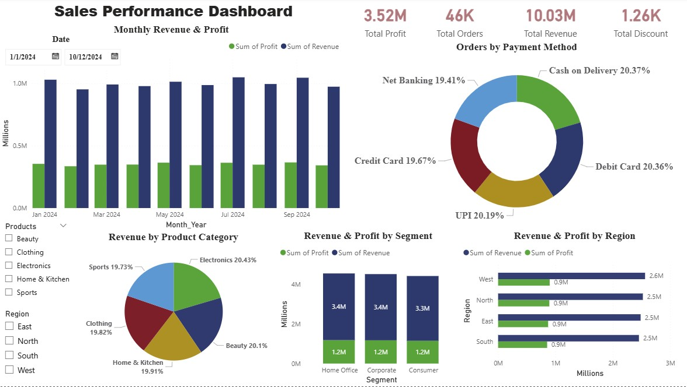

## Sales Performance Analysis Dashboard

## Project Overview

This project focuses on analyzing retail sales data to uncover key business insights such as revenue trends, profit performance, customer segmentation, and regional analysis.
Using SQL for data analysis and Microsoft Power BI for visualization, the project transforms raw data into an interactive dashboard for decision-making.
 
## Business Problem

The business lacks clear visibility into its sales performance, profitability, and customer behavior across different regions and product categories.
Due to the absence of a centralized reporting system, decision-makers are unable to:
- Identify high-performing regions and products    
- Understand customer purchasing patterns  
- Track sales trends over time  

This creates challenges in making data-driven decisions and optimizing overall business performance.

## Key Performance Indicators (KPIs)

- Total Revenue  
- Total Profit   
- Total Orders  
- Total Discount 

## Tools & Technologies

- SQL (MySQL)  
- Microsoft Power BI  
- Excel / CSV Dataset

## Dataset Description

The dataset contains:

- Order details (Order ID, Order Date)
- Customer information (Customer ID, Segment)
- Product categories
- Revenue, Cost, Profit
- Region and Payment Method

## Project Workflow
1️⃣ Database Creation
- Created database retail_db
- Imported dataset into MySQL

2️⃣ Data Cleaning
- Checked for NULL values
- Identified duplicate Order IDs
- Ensured data consistency

3️⃣ Exploratory Data Analysis (SQL)
Performed analysis to answer key business questions:

- What is the total revenue generated by the business?  
- What is the total profit generated from all sales?  
- What percentage of revenue is converted into profit?  
- How many unique customers purchased from the business?  
- What is the average revenue per order?  
- Which customer segment generates the most revenue?  
- What is the average revenue per customer?  
- What is the total revenue by region?  
- What is the total sales by region and product category?  
- Which product category generates the highest revenue?  
- Which region has the highest profit margin?  
- What is the overall financial performance?  
- How does revenue change month by month?  

##  Dashboard Preview

  

##  Key Insights
- Total Revenue exceeded 10Md
- Total Revenue exceeded 10Md
- Total Profit reached 3.5M
- West region generated highest revenue
- Electronics category contributed the most sales
- Balanced performance across customer segments
- Monthly revenue shows consistent trend

## Skills Demonstrated

- SQL Data Analysis  
- Data Cleaning & Validation  
- Business Insight Generation  
- Power BI Dashboard Development  
- Data Visualization & Storytelling

##  Business Value
This project helps the business:

- Identify top-performing regions and product categories to maximize revenue  
- Understand customer segments for targeted marketing strategies  
- Track monthly trends to support forecasting and planning  
- Enable data-driven decision-making through an interactive dashboard

##  Business Recommendations

- Focus on high-performing regions like West  
- Increase sales in top categories like Electronics  
- Optimize discount strategies to improve profit  
- Target customer segments with personalized marketing  

